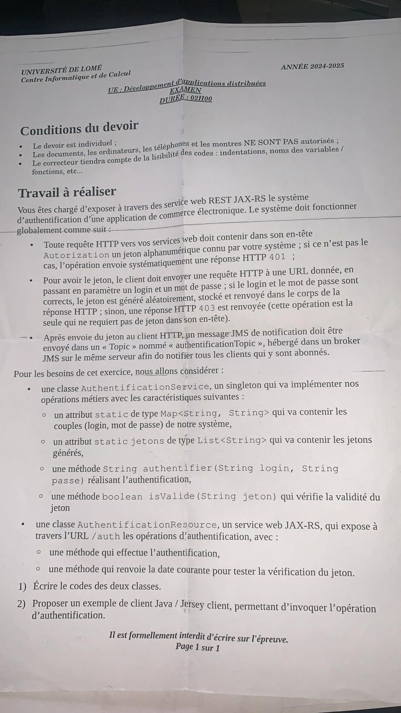

# Système d'Authentification avec JAX-RS et JMS

## Vue d'ensemble

Ce projet implémente un système d'authentification complet utilisant JAX-RS pour l'API REST et JMS pour les notifications. Il démontre l'intégration de plusieurs technologies Jakarta EE dans une application distribuée.

## Fonctionnalités principales

- Authentification par login/mot de passe
- Génération et validation de jetons
- Notification JMS des authentifications réussies
- Respect des conventions JavaBean

## Architecture

```
┌─────────────────┐    REST     ┌──────────────────┐
│  Client HTTP    │◄──────────► │ AuthResource     │
└─────────────────┘             └──────────────────┘
                                         │
                                         ▼
                                ┌──────────────────┐
                                │ AuthService      │
                                └──────────────────┘
                                         │
                                         ▼ JMS
                                ┌──────────────────┐
                                │ Topic           │
                                └──────────────────┘
```

## Composants

### AuthenticationService
- Singleton pour la gestion des credentials
- Génération et validation des jetons
- Stockage sécurisé des données

### AuthenticationResource
- Endpoints REST pour l'authentification
- Gestion des requêtes HTTP
- Intégration avec JMS pour les notifications

## API REST

### Endpoints

#### Authentification
```
POST /auth
Parameters:
  - login (query)
  - password (query)
Response:
  - 200 OK : Token généré
  - 401 Unauthorized : Credentials invalides
```

#### Vérification de token
```
GET /auth/verify
Header:
  - Authorization: <token>
Response:
  - 200 OK : Date courante
  - 401 Unauthorized : Token invalide
```

## Notification JMS

- Topic : `jms/authentificationTopic`
- Message : Notification d'authentification réussie
- Format : Texte avec informations utilisateur

## Configuration

### Dépendances Maven
```xml
<dependency>
    <groupId>jakarta.platform</groupId>
    <artifactId>jakarta.jakartaee-api</artifactId>
    <version>10.0.0</version>
</dependency>
```

### Ressources JMS
- ConnectionFactory : `jms/cf1`
- Topic : `jms/authentificationTopic`

## Tests

### Client de test fourni
- Test d'authentification
- Test de vérification de token
- Gestion des erreurs

## Points clés

1. **Sécurité**
   - Validation des entrées
   - Gestion sécurisée des tokens
   - Notifications des événements

2. **Design Patterns**
   - Singleton pour AuthService
   - Factory pour JMS
   - Builder pour Response

3. **JavaBean**
   - Constructeur sans arguments
   - Getters/Setters appropriés
   - Propriétés privées

## Questions de révision

1. Comment fonctionne l'authentification avec JAX-RS ?
2. Comment gérer les jetons d'authentification ?
3. Comment intégrer JMS pour les notifications ?

## Liens utiles

- [Documentation JAX-RS](https://jakarta.ee/specifications/restful-ws/)
- [Documentation JMS](https://jakarta.ee/specifications/messaging/) 